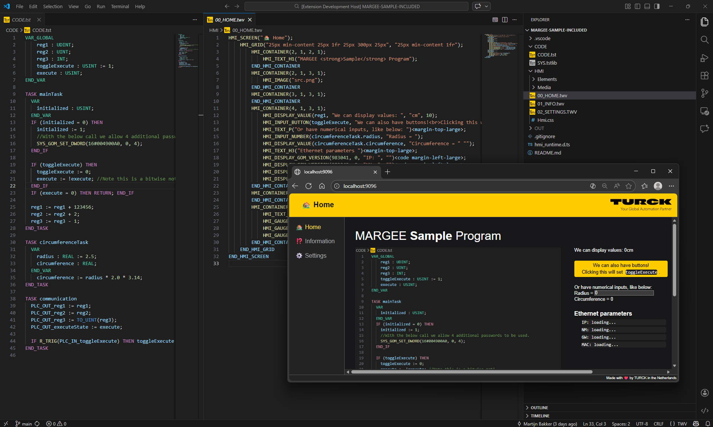

import { LinkButton } from '@astrojs/starlight/components';
import { Card, CardGrid } from '@astrojs/starlight/components';

  

    
  

Get started with your first project, explore the features capabilities of the extension.

<LinkButton href="guides/firstproject/">Get started</LinkButton>
<LinkButton href="basicinfo/argeemargee/" variant="secondary">Supported Devices</LinkButton>

